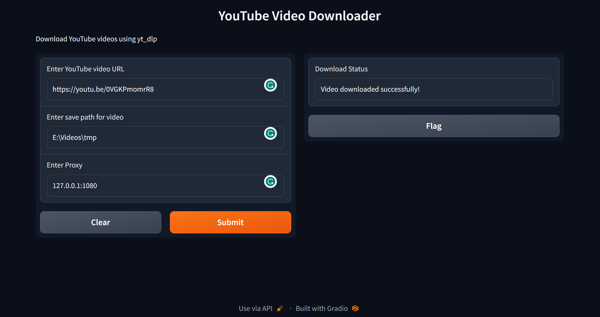

<p align="center">
  <h1 align="center"><br><ins>Youtube downloader/player</ins><br>YouTube Video Downloader</h1> 
</p>

## Description

A simple python script to download YouTube videos and play them. It uses the [yt_dlp](https://github.com/yt-dlp/yt-dlp) library to download the videos. It also has a GUI made using [gradio](https://gradio.app/).
This is an upgrade of Vincentqyw's youtube downloader repo. all props for the base https://github.com/Vincentqyw/youtube-dl-webui. 

## How to use

### requirements
``` bash
pip install -r requirements.txt
```
### run demo
``` bash
python3 app.py
```
